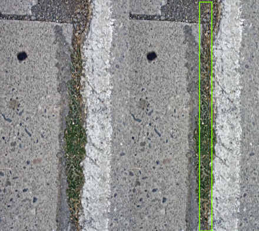
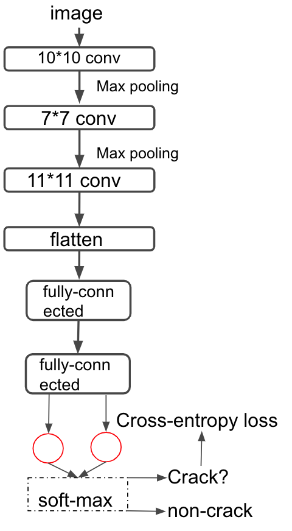
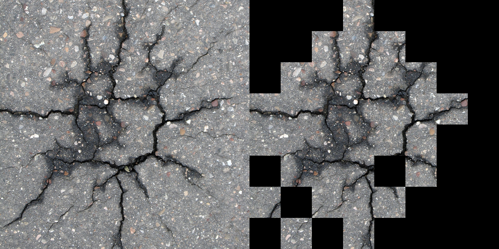

# Crack_Detection via CNN
Crack is a complete or incomplete separation of concrete into two or more parts produced by breaking or fracturing. Previous methodology to.
Here we start from scratch where we collected images from road near davis where we attached a sensor on the bike and went through the road. We then utilized CV2 to preprocess the images shown at the left subplot below. After that we artificially annotate the images in terms of the bounding box information of the cracks served as groundtruth shown at the right subplot below. 

#### In total we have 50000 images of 1024 * 1024 size. We designed a CNN(Convolutional Neural Network) to detect the image crack treated as a binary classification problem in the small sub-blocks with size (128 * 128) of whether there is a crack on the sub-block. 

##### The architecture for the CNN is shown as below.

##### To evaluate the model, we utilize MCC(Matthew's coefficient of correlation which leverage the TP,FP,FN,TN together) to calculate the efficiency of binary classification.

###### Selected results is shown as below:

## After fitting on our datasets, we generalize our model to other crack datasets from Internet and we observe that it can efficiently detect the cracks with irregular shape.
(left subplot is the original plot and the right subplot represent the detected plot).

